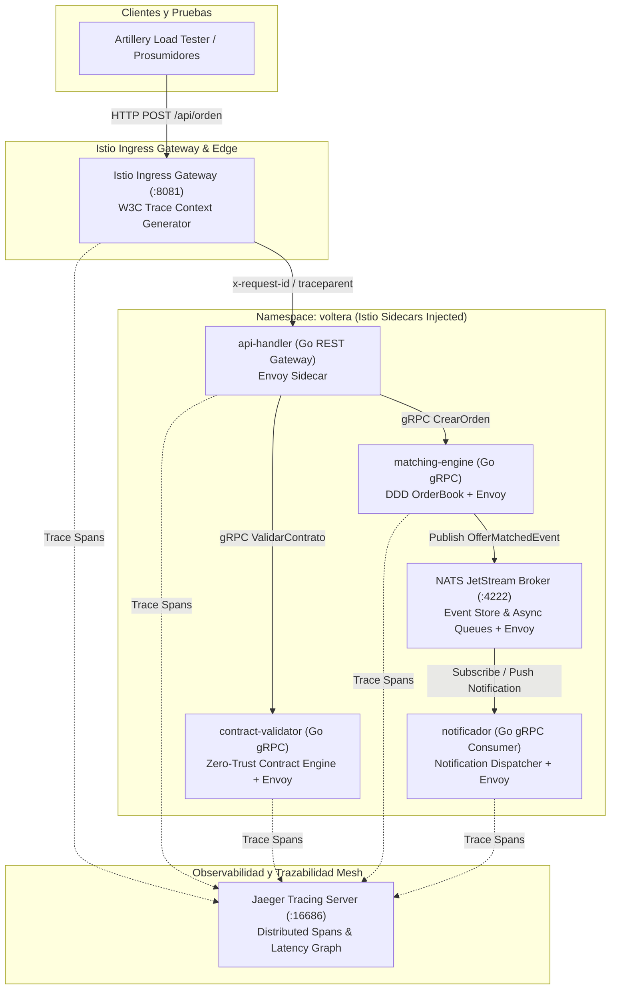

# Voltera P2P Solar Energy Trading Platform Engine (Kubernetes + Istio Service Mesh)

Sistema distribuido de emparejamiento (*Matching Engine*) de energía solar Peer-to-Peer (P2P) bajo **Arquitectura Hexagonal**, **DDD Táctico**, **Istio Service Mesh**, **mTLS Zero-Trust**, **NATS JetStream Event Broker** y **Trazabilidad Distribuida (W3C Trace Context & Jaeger)**.

---

## 🏛️ Arquitectura del Sistema con Istio Service Mesh

La arquitectura sigue una topología nativa de Kubernetes respaldada por la malla de servicios **Istio**. El tráfico perimetral ingresa mediante el **Istio Ingress Gateway**, el cual inyecta la cabecera `traceparent` (W3C) y la propaga hacia los pods. 

Todas las comunicaciones inter-servicio (Este-Oeste) son interceptadas por los sidecars **Envoy**, garantizando cifrado **mTLS Zero-Trust** y exportando métricas y trazabilidad directamente a **Jaeger**, sin sobrecarga de instrumentación manual.



---

## 🎯 Atributos de Calidad y Escenarios ASR (Architectural Significant Requirements)

### 🚀 ASR 1: Desempeño y Latencia en Emparejamiento P2P (Performance)
* **Fuente del Estímulo:** Prosumidores solares (paneles solares residenciales / comerciales).
* **Estímulo:** Envío continuo de órdenes de compra/venta de energía solar.
* **Artefacto:** Cluster Kubernetes de `api-handler` + `matching-engine` en Go + NATS JetStream.
* **Entorno:** Carga distribuida estocástica (Prueba de ráfagas con Artillery).
* **Respuesta:** Validar contrato, procesar orden en el OrderBook (DDD Aggregate), realizar match y notificar asíncronamente vía NATS.
* **Medida de Respuesta:** Latencia en percentil 95 ($p95$) $\le 300\text{ ms}$ desde la ingesta REST hasta el emparejamiento. **(Medido en ejecución real: $p95 = 102.5\text{ ms}$ para 39.980 peticiones)**.

### 🛡️ ASR 2: Ciberseguridad y Validación Zero-Trust (Security & Mesh mTLS)
* **Fuente del Estímulo:** Dispositivo o actor malicioso en la red interna o externa.
* **Estímulo:** Solicitud con firmas digitales corruptas, valores energéticos anómalos ($\le 0$ kWh) o tráfico interceptado en tránsito.
* **Artefacto:** Microservicio `contract-validator` + Malla Istio Envoy mTLS STRICT.
* **Entorno:** Operación en producción bajo arquitectura Zero-Trust.
* **Respuesta:** Istio cifra todo el tráfico inter-servicio automáticamente con certs TLS efímeros y `contract-validator` rechaza contratos alterados.
* **Medida de Respuesta:** 100% del tráfico Este-Oeste cifrado bajo mTLS Zero-Trust; contratos inválidos descartados en $< 1\text{ ms}$ retornando `HTTP 400 Bad Request`.

### ⚡ ASR 3: Escalabilidad y Desacoplamiento por Eventos (Scalability & Resiliency)
* **Fuente del Estímulo:** Ráfaga pico solar (Event Storm) en horas de máxima radiación (mediodía).
* **Estímulo:** Ráfagas de ráfagas pico de órdenes simultáneas.
* **Artefacto:** NATS JetStream Event Broker + Istio Ingress Gateway + Pods autoescalables en K8s.
* **Entorno:** Pico de carga extremo.
* **Respuesta:** `matching-engine` publica el evento de emparejamiento en el tópico `energy.matches` de NATS sin esperar respuestas sincrónicas, liberando el hilo HTTP inmediatamente.
* **Medida de Respuesta:** Resiliencia y disponibilidad del 100% sin cuellos de botella en la entrega de notificaciones.

---

## 📈 Trazabilidad Distribuida y Observabilidad con Istio + Jaeger

El sistema eliminó la necesidad de librerías manuales de Prometheus. Toda la observabilidad es recolectada de forma transparente por los proxies Envoy de Istio y enviada a **Jaeger**.

### Cabeceras W3C & B3 Propagadas por los Microservicios Go:
Para evitar romper el árbol de trazabilidad (*Span Tree*), el código Go extrae y reinyecta activamente:
* `x-request-id`
* `traceparent` / `tracestate` (Estándar W3C)
* `x-b3-traceid`, `x-b3-spanid`, `x-b3-sampled` (Estándar B3 Zipkin/Jaeger)

### Acceso a la Interfaz Gráfica de Jaeger:
El dashboard de trazabilidad distribuida se expone en puerto local:
```bash
# Servidor visual de Jaeger (Gantt Charts de latencia y llamadas gRPC):
http://localhost:16686
```

---

## 🛠️ Estructura de Microservicios y Manifiestos K8s

El proyecto cuenta con la siguiente organización bajo Arquitectura Hexagonal y manifiestos de Kubernetes:

```text
voltera-p2p-go/
├── api-handler/          # REST Gateway Go (Propaga cabeceras HTTP -> gRPC metadata)
├── contract-validator/   # Microservicio Zero-Trust de Validación gRPC
├── matching-engine/      # Motor P2P DDD (OrderBook, Entidad Offer, Value Objects)
├── notificador/          # Suscriptor / Consumer gRPC de notificaciones
├── proto/                # Definiciones Protocol Buffers (p2p.proto)
├── k8s/                  # Manifiestos de Kubernetes e Istio Service Mesh
│   ├── deployments.yaml  # Deployments y Services de los 4 microservicios Go
│   ├── istio-gateway.yaml# Istio Gateway & VirtualService (Ruteo Ingress)
│   └── nats.yaml         # Servidor NATS JetStream Event Broker
└── artillery-tests/      # Suites de Pruebas de Carga y Ráfagas (Artillery)
```

---

## 🚀 Despliegue y Ejecución en Kubernetes (Kind + Istio)

### 1. Requisitos Previos
* **Docker**, **kubectl**, **kind** y **istioctl** instalados.

### 2. Crear Clúster e Instalar Istio
```bash
# Crear clúster Kind optimizado
kind create cluster --name voltera-istio --config /tmp/kind-config.yaml

# Instalar plano de control de Istio y Jaeger
istioctl install --set profile=demo -y
kubectl apply -f https://raw.githubusercontent.com/istio/istio/release-1.21/samples/addons/jaeger.yaml -n istio-system

# Habilitar inyección de sidecars Istio en el namespace
kubectl create namespace voltera
kubectl label namespace voltera istio-injection=enabled
```

### 3. Aplicar Manifiestos de la Aplicación y NATS
```bash
kubectl apply -f k8s/deployments.yaml
kubectl apply -f k8s/istio-gateway.yaml
kubectl apply -f k8s/nats.yaml
```

### 4. Ejecutar Prueba de Carga (Artillery)
```bash
cd artillery-tests
npx artillery run test-p2p.yml
```
